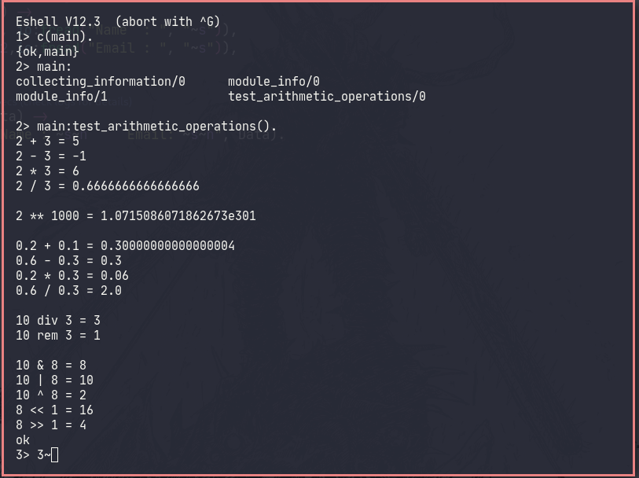
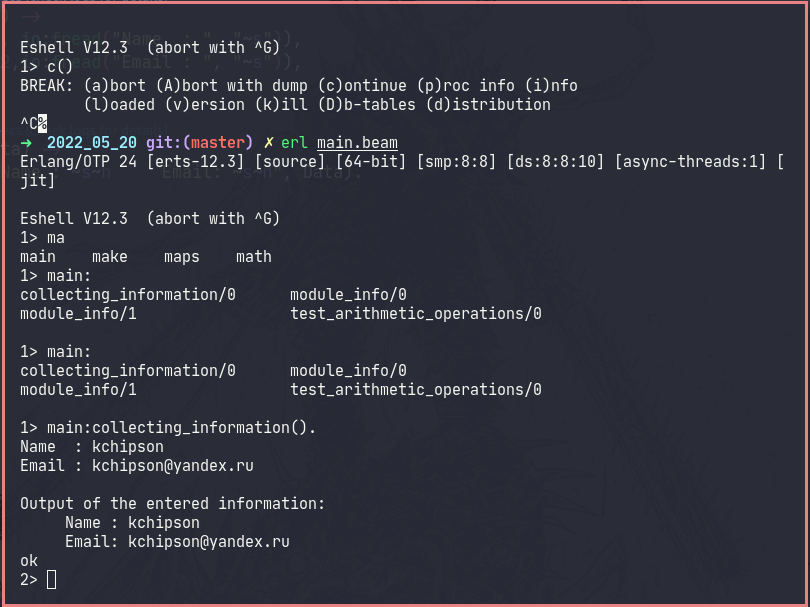

# Homework #(1-2)

## 1. Install Linux-based OS (~Ubuntu)

## 2. Install and check Erlang

## 3. Test arithmetic operations

### Test arithmetic operations

## 4. Module/script for collecting information (email, name) about the user

### Collecting information about the user

## 5. Register on GitHub

## 6. Create repository for lessons

## 7. Commit and push source from homework to GitHub
