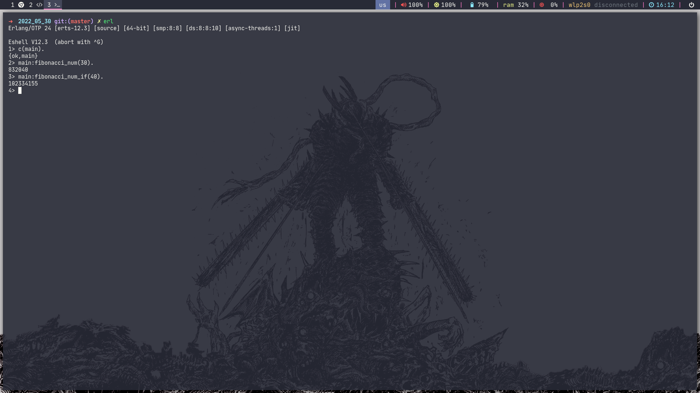
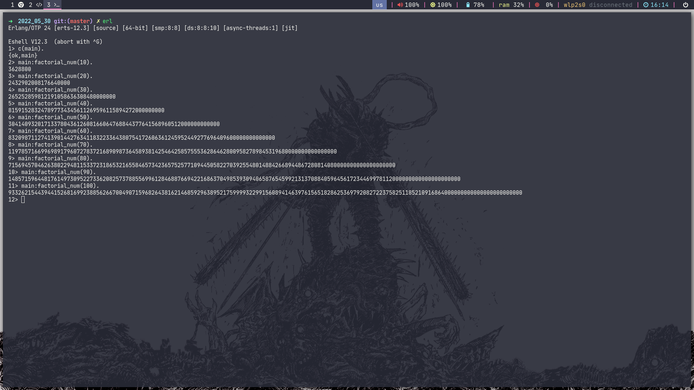
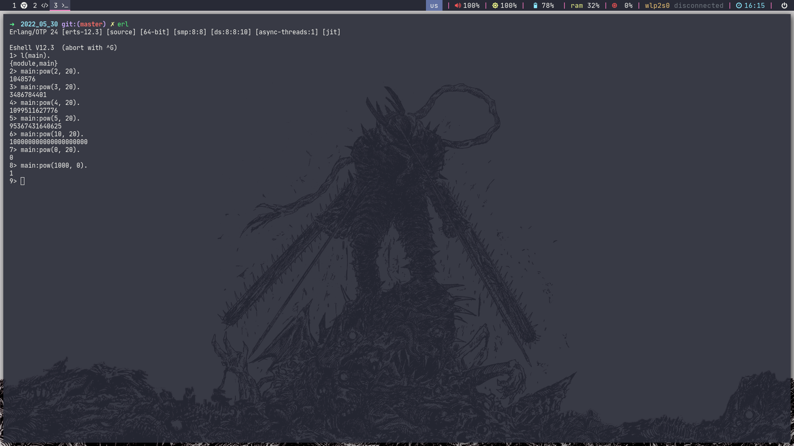
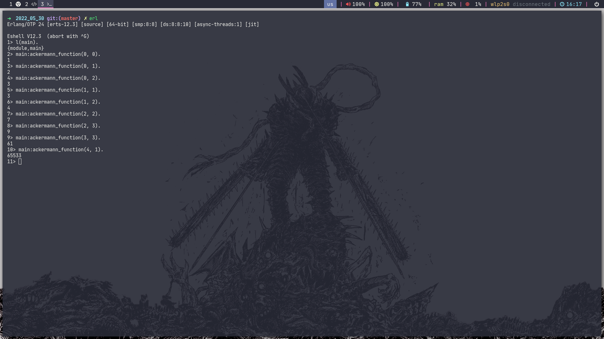
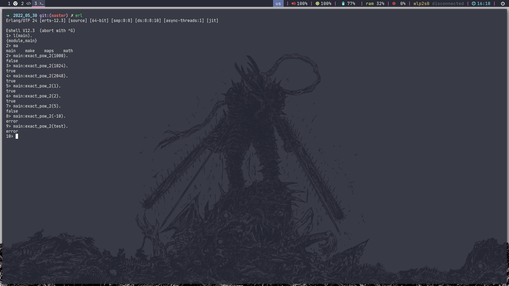
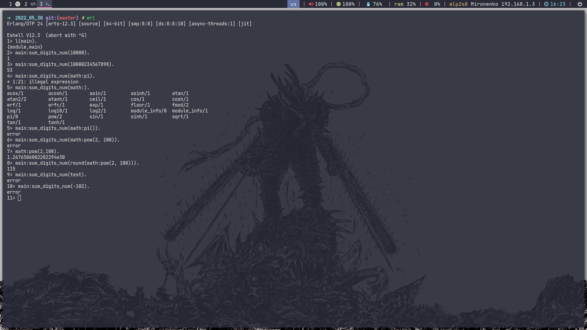
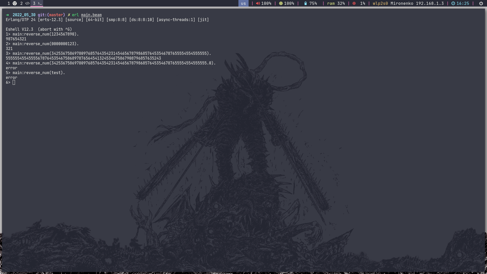

# Homework #3

## 1. Module for test functions

## 2. Fibonacci

### Fibonacci

## 3. Factorial / Pow

### Factorial

### Pow

## 4. https://habr.com/ru/post/275813/ - two or more tasks

### C: Функция Аккермана

### D: Точная степень двойки

### E: Сумма цифр числа

### U: Разворот числа

