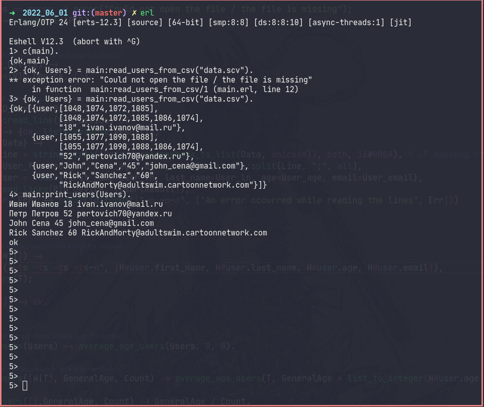
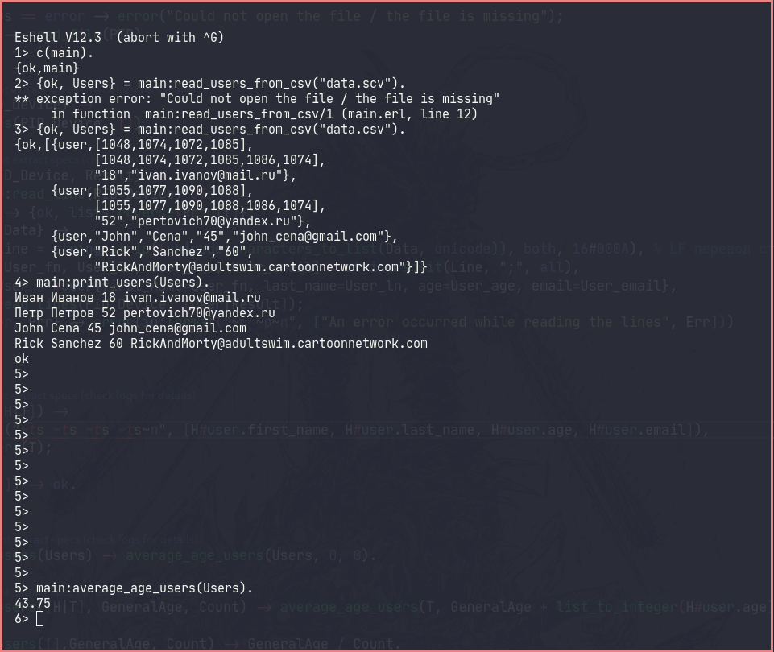

# Homework #4

## 1. Working with files

## 2. Working with CSV (String)

### Reading from CSV

## 3. Find out the average age of users through recursion

### Average age of users through recursion

## 4. Using Map or Record to store users
