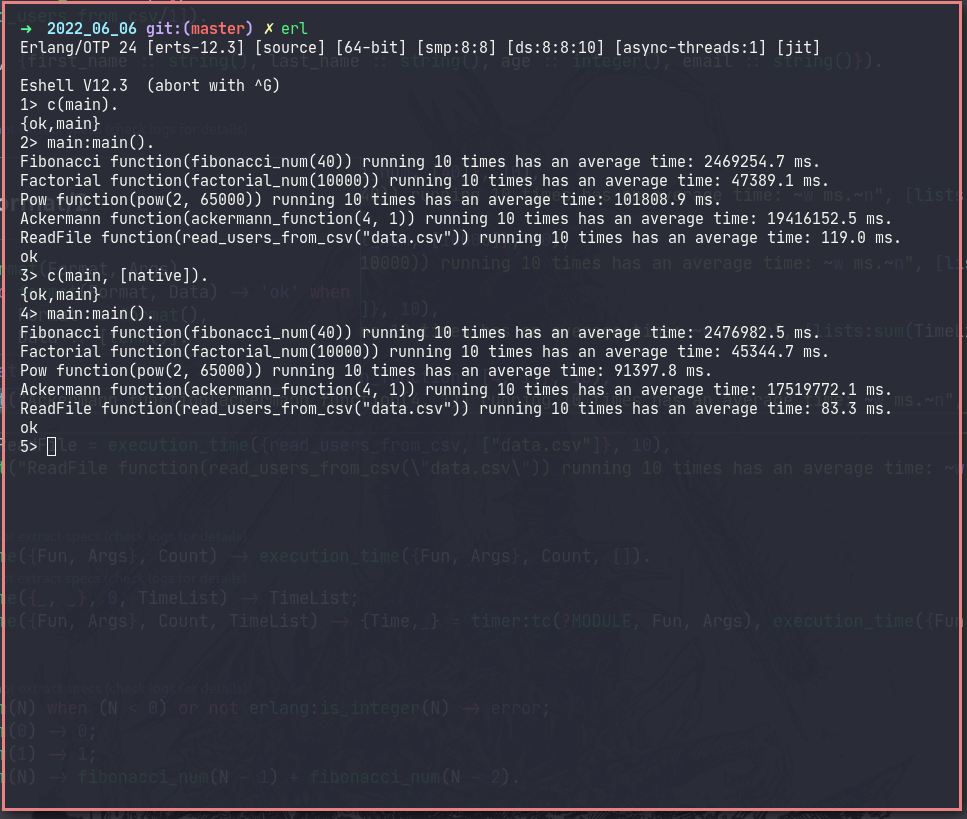

# Homework #5   

## 1.  Use HiPE for past homework (recursion + working with files)

### Compilation using HiPE and without

## 2.  The average age of the user via the list generator

### Average age of the user via the list generator

