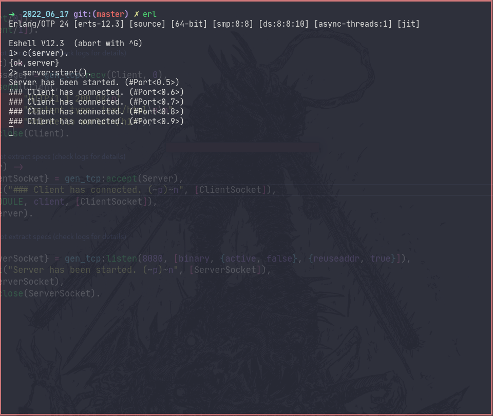
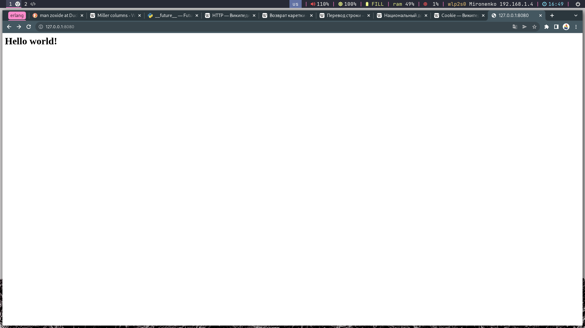

# Homework #6-7  

## 1.  Familiarize yourself with the HTTP protocol
## 2.  Install MySQL
## 3.  Install Rebar3
## 4.  Implement web-server(TCP Socket + Spawn)

### Starting and operation of the web server

### Result of the web server
