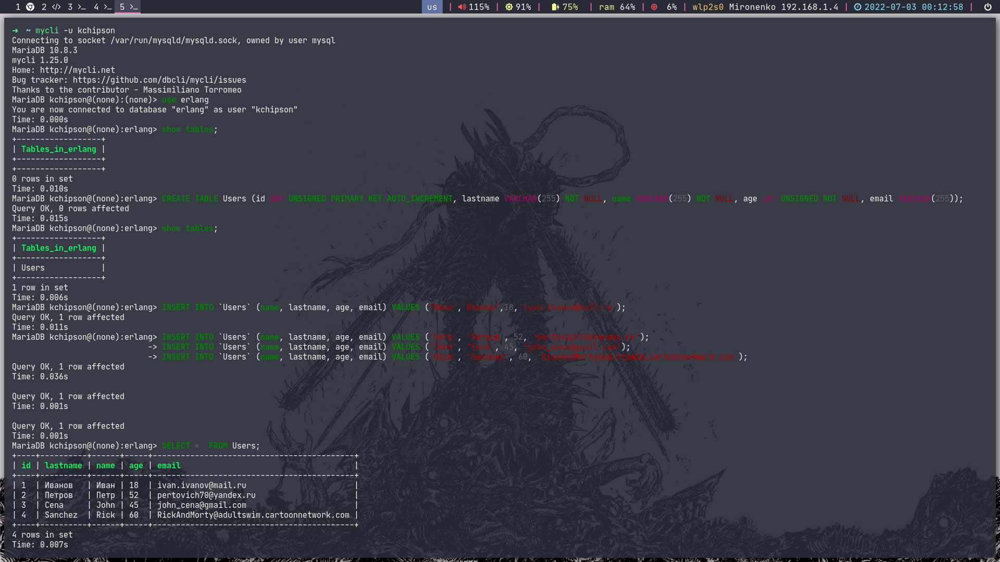
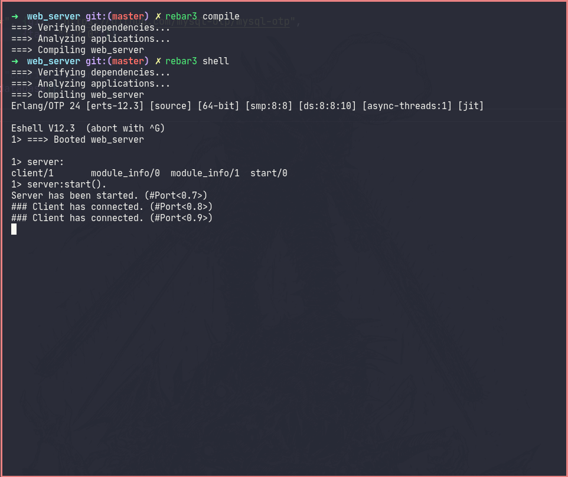
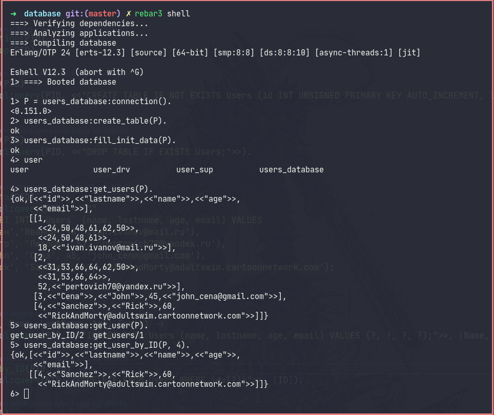

# Homework #8  

## 1.  Install MySQL

## 2.  Work with MySQL from the terminal

### MySQL from the terminal

## 3.  Install rebar3

## 4.  Create and build a project using rebar 3 for web server

## 5.  Module for working with MySQL

## 6.  Read about REST
